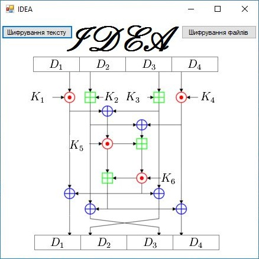
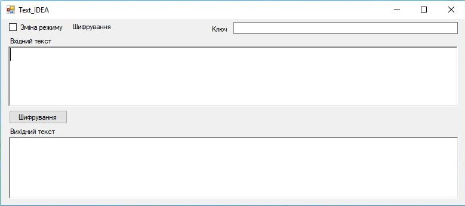
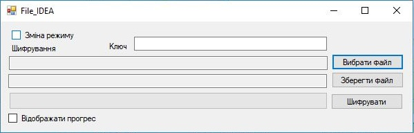

# IDEA

Шифрование текста и файлов блочным алгоритмом IDEA

## Применение

Делалась как курсовая работа... подойдет для сдачи в вашем више

При шифрование файлов появляеться утечка памяти (не исправлено)

Для максимальной скорости шифрования нужно собрать релизную версию (а кто хочет сделать паралельную обработку)

## Сделано с использованием

Сторонние библиотеки не использовались

## Пример

-Выберети что будет шифроваться текст или файл

-Если шифруетьсятекст введите ключ и текст в поля 

-Если шифруеться файл введите ключ и выберети файл 

